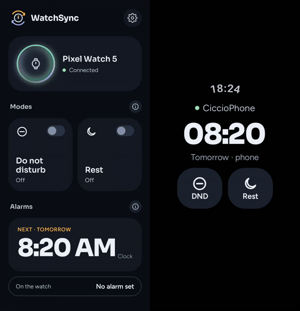
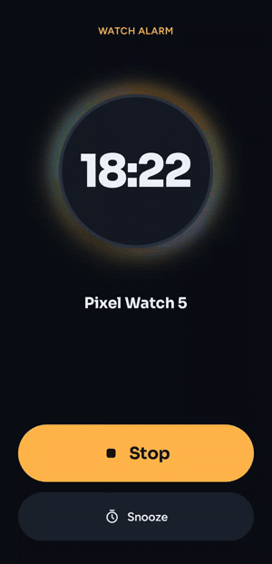
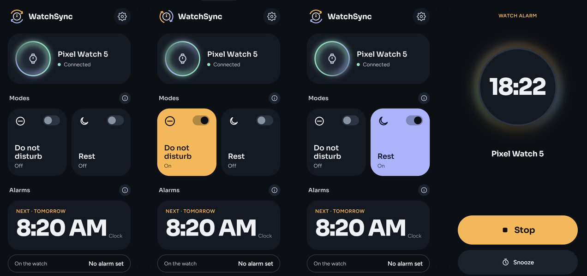
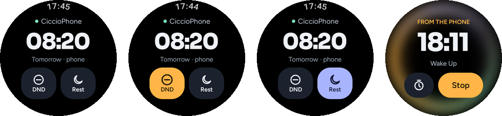

# WatchSync

**Keeps your phone and your Wear OS watch in step: Do Not Disturb, Bedtime and alarms.**

Wear OS mirrors only part of what happens on the phone, and only with some phones. WatchSync
fills the gaps, both ways:

- **Do Not Disturb, 1:1.** Turn it on or off on either device and the other follows.
- **Bedtime / Rest, 1:1.** The phone's own Rest mode (Digital Wellbeing, Samsung Sleep, Honor
  Rest…) becomes Bedtime on the watch, with its night look; Bedtime started on the watch becomes
  Rest on the phone. DND and Rest are never on together.
- **Alarms on both.** A phone alarm rings on the watch too, a watch alarm rings on the phone too.
  Stop or snooze it on either device and it stops on both.

No account, no cloud of its own, no ads, no tracking. Free software under the GPL.

<p align="center">
  
  &nbsp;&nbsp;
  
</p>

<p align="center">
  
</p>
<p align="center">
  
</p>

## Requirements

- An Android phone running Android 15 or later.
- A Wear OS watch running Wear OS 4 or later, paired with the phone. Developed and tested on a
  Pixel Watch 5 with a HONOR Magic V6 (Android 17).
- WatchSync installed on both.

## Setup

The phone app walks you through it. Everything is one-time:

1. A few permissions on the phone (notifications, notification access, Do Not Disturb access,
   full-screen alarms).
2. **Set up the watch.** On Wear OS some permissions can only be granted through debugging, so
   the phone grants them once over the watch's wireless debugging: you open *Developer options ›
   Wireless debugging › Pair new device* on the watch and type the code into the phone. When it's
   done, WatchSync turns wireless debugging off again. No computer needed.
3. Android then asks you to confirm that WatchSync may manage the watch.
4. **Phone Rest mode.** Android doesn't tell apps which mode is on, so WatchSync learns to
   recognise your Rest mode by its rules: turn it on once from the quick settings.

Each step has an ⓘ in the app explaining what it's for and how to fix it if it fails.

## Privacy

WatchSync collects nothing. Phone and watch talk to each other only through Wear OS's own data
layer; the app has no server and sends nothing anywhere else. It doesn't read or forward the
content of your notifications: it only looks for which mode is on and whether an alarm is ringing.
See [PRIVACY.md](PRIVACY.md).

## Building

Android Studio (or the Gradle wrapper) with JDK 17:

```
./gradlew :mobile:assembleDebug :wear:assembleDebug
```

Release builds read the signing key from `../.keys/keystore.properties`, outside the repository.

## How it was made

WatchSync is built with heavy AI assistance (Claude Code — "vibe coding", if you like). Every
change is reviewed and tested by hand on real devices, but keep that in mind when you read the
code, and please report anything odd.

## Contributing

Issues and pull requests are welcome — see [CONTRIBUTING.md](CONTRIBUTING.md).

## License

Copyright © 2026 SanniniciStyle.

WatchSync is free software: you can redistribute it and/or modify it under the terms of the GNU
General Public License as published by the Free Software Foundation, either version 3 of the
License, or (at your option) any later version. See [LICENSE](LICENSE).

Third-party components and their licences are listed in the app under *Settings › Open source
licences*. Wear OS and Pixel are trademarks of Google LLC; WatchSync is not affiliated with Google.
